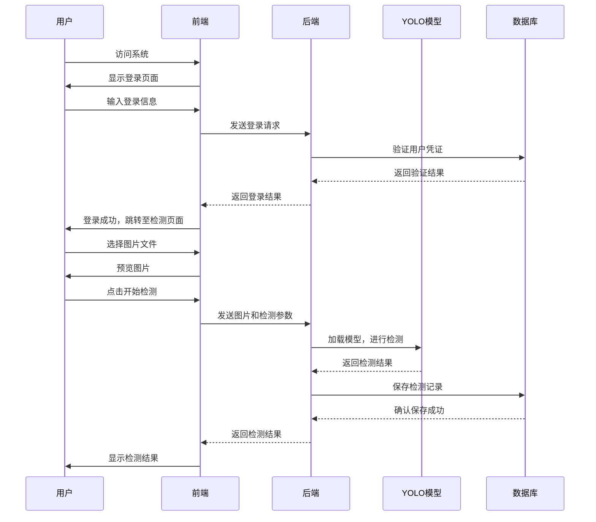

# 核心业务流程与技术分析

## 1. 核心业务流程

### 1.1 用户认证流程
1. **用户访问系统**：打开系统首页，自动重定向到登录页面
2. **用户登录**：输入用户名和密码，前端发送登录请求到后端
3. **后端验证**：验证用户凭证，返回认证结果
4. **前端状态管理**：登录成功后，前端存储用户信息，跳转至检测页面

### 1.2 图片检测流程
1. **图片上传**：用户在上传页面选择图片文件
2. **前端处理**：前端预览图片，设置检测参数（置信度、IoU阈值等）
3. **发送请求**：前端将图片和参数发送到后端`/api/detect`端点
4. **后端处理**：
   - 接收图片文件
   - 加载YOLO模型
   - 进行目标检测
   - 绘制检测结果
   - 保存检测记录到数据库
5. **返回结果**：后端返回检测结果，包括标注后的图片、检测到的目标数量、置信度等
6. **前端展示**：前端显示检测结果，提供下载、导出等操作

### 1.3 视频检测流程
1. **视频上传**：用户在视频检测页面选择视频文件
2. **前端处理**：前端预览视频信息，设置检测参数
3. **发送请求**：前端将视频和参数发送到后端`/api/video/detect`端点
4. **后端处理**：
   - 接收视频文件
   - 逐帧处理视频
   - 进行目标检测
   - 生成标注后的视频
   - 计算检测统计信息
   - 保存检测记录到数据库
5. **返回结果**：后端返回处理后的视频URL、检测统计信息等
6. **前端展示**：前端播放处理后的视频，显示检测统计信息

### 1.4 摄像头检测流程
1. **选择摄像头**：用户选择使用服务器摄像头或本地摄像头
2. **权限请求**：如果选择本地摄像头，前端请求摄像头权限
3. **启动检测**：
   - 服务器摄像头：发送请求到`/api/camera/start`端点
   - 本地摄像头：前端捕获摄像头帧，发送到`/api/camera/detect_frame`端点
4. **实时检测**：
   - 服务器摄像头：后端处理摄像头帧，通过SSE推送结果
   - 本地摄像头：前端定期捕获帧，发送到后端处理，接收并显示结果
5. **停止检测**：发送请求到`/api/camera/stop`端点停止检测

### 1.5 历史记录管理流程
1. **查看记录**：用户访问历史记录页面，前端请求`/api/history`获取所有记录
2. **筛选搜索**：用户可以按时间范围、检测类型等筛选记录，按文件名搜索记录
3. **查看详情**：点击记录查看详细信息，前端请求`/api/records/<id>`获取详细数据
4. **批量操作**：选择多条记录进行批量删除、导出等操作
5. **单条操作**：对单条记录进行查看、下载、删除等操作

## 2. 前后端交互方式

### 2.1 API调用模式
- **前端**：使用Axios库发送HTTP请求
- **后端**：使用Flask框架提供RESTful API
- **数据格式**：JSON格式进行数据交换

### 2.2 具体交互示例

#### 2.2.1 图片检测交互
```javascript
// 前端代码示例（简化）
const detectImage = async (formData) => {
  try {
    const response = await axios.post('http://localhost:5000/api/detect', formData, {
      headers: { 'Content-Type': 'multipart/form-data' }
    });
    return response.data;
  } catch (error) {
    console.error('检测失败:', error);
    throw error;
  }
};
```

```python
# 后端代码示例（简化）
@app.route('/api/detect', methods=['POST'])
def detect():
    # 处理图片上传
    # 进行目标检测
    # 保存检测记录
    # 返回检测结果
    return jsonify({
        "success": True,
        "image_url": processed_image_url,
        "total_detections": total_detections,
        "avg_confidence": avg_confidence,
        "record_id": record_id,
        "model_used": model_name
    })
```

#### 2.2.2 本地摄像头检测交互
```javascript
// 前端代码示例（简化）
const startLocalCameraStream = async () => {
  try {
    // 获取摄像头权限
    const stream = await navigator.mediaDevices.getUserMedia({ video: true });
    videoRef.value.srcObject = stream;
    
    // 定期捕获帧并发送到后端
    const processFrame = async () => {
      if (!isLocalCameraRunning.value) return;
      
      // 捕获帧
      canvasRef.value.width = videoRef.value.videoWidth;
      canvasRef.value.height = videoRef.value.videoHeight;
      const ctx = canvasRef.value.getContext('2d');
      ctx.drawImage(videoRef.value, 0, 0);
      
      // 转换为base64
      const imageData = canvasRef.value.toDataURL('image/jpeg', 0.8).split(',')[1];
      
      // 发送到后端
      const response = await axios.post('http://localhost:5000/api/camera/detect_frame', {
        image: imageData,
        use_gpu: useGpu.value,
        force_cpu: forceCpu.value
      });
      
      // 显示结果
      if (response.data.success) {
        resultImage.value = `data:image/jpeg;base64,${response.data.image}`;
        detectionResults.value = response.data.detections;
      }
      
      // 继续处理下一帧
      requestAnimationFrame(processFrame);
    };
    
    processFrame();
  } catch (error) {
    console.error('摄像头启动失败:', error);
    ElNotification.error('无法访问摄像头');
  }
};
```

```python
# 后端代码示例（简化）
@app.route('/api/camera/detect_frame', methods=['POST'])
def detect_frame():
    try:
        # 解码base64图像
        image_data = base64.b64decode(image_base64)
        np_arr = np.frombuffer(image_data, np.uint8)
        frame = cv2.imdecode(np_arr, cv2.IMREAD_COLOR)
        
        # 选择设备
        device = select_device(use_gpu=use_gpu, force_cpu=force_cpu)
        
        # 运行检测
        results = current_model(frame, device=device, verbose=False)
        
        # 处理检测结果
        detections = []
        total_detections = 0
        # ... 处理检测结果 ...
        
        # 绘制检测结果
        annotated_frame = results[0].plot()
        
        # 将结果编码为base64
        _, buffer = cv2.imencode('.jpg', annotated_frame)
        result_base64 = base64.b64encode(buffer).decode('utf-8')
        
        return jsonify({
            "success": True,
            "image": result_base64,
            "detections": detections,
            "total_detections": total_detections,
            "device_used": device.type
        })
    except Exception as e:
        app.logger.error(f"处理本地摄像头帧失败: {e}")
        return jsonify({"success": False, "message": f"处理失败: {str(e)}"}), 500
```

### 2.3 实时通信
- **服务器摄像头**：使用Server-Sent Events (SSE) 实现实时视频流推送
- **本地摄像头**：使用前端`requestAnimationFrame`定期捕获帧并发送到后端

## 3. 异常处理和错误码设计

### 3.1 前端异常处理
- **网络错误**：使用Axios的error处理捕获网络请求错误
- **业务错误**：检查后端返回的`success`字段，处理业务逻辑错误
- **用户提示**：使用Element Plus的Notification组件显示错误提示
- **边界情况**：处理空数据、超时等边界情况

```javascript
// 前端异常处理示例
try {
  const response = await axios.post('/api/detect', formData);
  if (response.data.success) {
    // 处理成功情况
  } else {
    // 处理业务错误
    ElNotification.error(response.data.error || '检测失败');
  }
} catch (error) {
  // 处理网络错误
  ElNotification.error('网络请求失败，请检查网络连接');
  console.error('请求错误:', error);
}
```

### 3.2 后端异常处理
- **全局异常捕获**：使用try-except捕获异常
- **日志记录**：记录异常详细信息到日志文件
- **错误响应**：返回标准化的错误响应
- **HTTP状态码**：使用适当的HTTP状态码表示错误类型

```python
# 后端异常处理示例
try:
    # 业务逻辑
except Exception as e:
    app.logger.error(f"处理失败: {e}")
    return jsonify({
        "success": False,
        "error": f"处理失败: {str(e)}"
    }), 500
```

### 3.3 错误码设计
系统使用以下错误处理模式：

| 错误类型 | HTTP状态码 | 响应格式 | 描述 |
|---------|-----------|---------|------|
| 成功 | 200 | `{"success": true, "data": {...}}` | 操作成功 |
| 业务错误 | 400 | `{"success": false, "error": "错误信息"}` | 请求参数错误或业务逻辑错误 |
| 未找到 | 404 | `{"success": false, "error": "记录不存在"}` | 请求的资源不存在 |
| 服务器错误 | 500 | `{"success": false, "error": "服务器内部错误"}` | 服务器内部异常 |

## 4. 第三方服务集成

### 4.1 前端第三方库
- **Vue 3.5.26**：前端框架
- **TypeScript 5.9.3**：类型系统
- **Element Plus 2.13.0**：UI组件库
- **Vite 7.3.0**：构建工具
- **Pinia 3.0.4**：状态管理
- **Vue Router 4.6.4**：路由管理
- **Axios 1.13.2**：HTTP客户端
- **xlsx**：Excel文件导出

### 4.2 后端第三方库
- **Flask**：Web框架
- **YOLOv11 (ultralytics)**：目标检测模型
- **PyTorch 2.10.0+cu128**：深度学习框架
- **OpenCV**：图像处理库
- **MySQL (pymysql)**：数据库驱动
- **python-dotenv**：环境变量管理
- **numpy**：数值计算库
- **base64**：Base64编码/解码
- **threading**：多线程处理
- **queue**：队列管理

### 4.3 集成方式
- **模型集成**：使用ultralytics库加载和使用YOLOv11模型
- **数据库集成**：使用pymysql直接连接MySQL数据库
- **文件处理**：使用OpenCV处理图像和视频文件
- **前端组件**：使用Element Plus组件构建UI界面
- **状态管理**：使用Pinia管理前端应用状态
- **路由管理**：使用Vue Router管理前端路由

### 4.4 第三方服务依赖
- **PyTorch GPU支持**：依赖CUDA环境进行GPU加速
- **OpenCV视频处理**：依赖FFmpeg进行视频编解码
- **MySQL数据库**：依赖MySQL服务器存储数据
- **浏览器API**：依赖浏览器的MediaDevices API获取摄像头权限

## 5. 技术亮点与优势

1. **多模态检测**：支持图片、视频和摄像头实时检测，满足不同场景需求
2. **设备自适应**：自动检测和切换CPU/GPU设备，优化检测性能
3. **实时摄像头检测**：支持本地和服务器摄像头，实现实时缺陷检测
4. **丰富的前端交互**：提供筛选、搜索、批量操作等功能，提升用户体验
5. **完整的历史记录管理**：支持查看、删除、导出检测记录，方便数据管理
6. **详细的检测结果**：包括置信度、位置、类别等信息，提供全面的检测数据
7. **美观的UI设计**：现代化的响应式界面，提升用户体验
8. **模块化架构**：前后端分离，模块化设计，便于维护和扩展

## 6. 系统流程图


